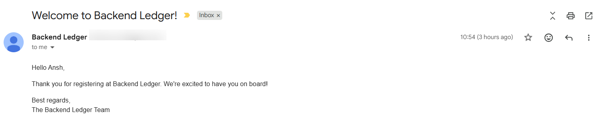
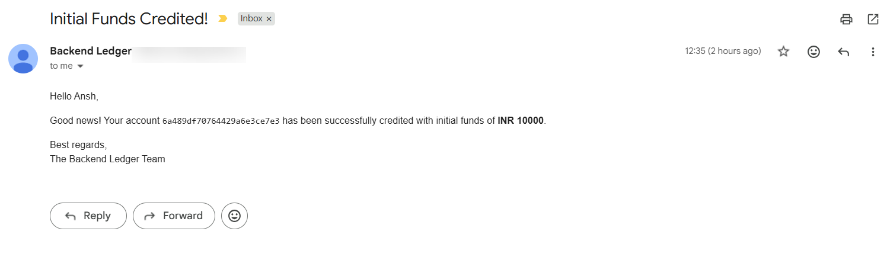
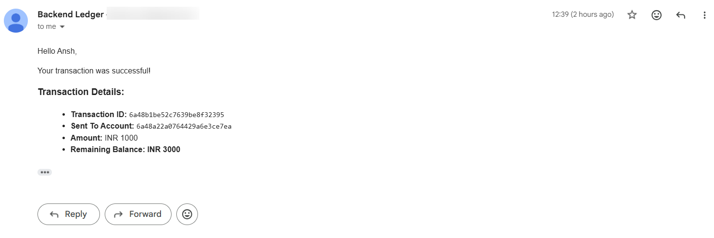
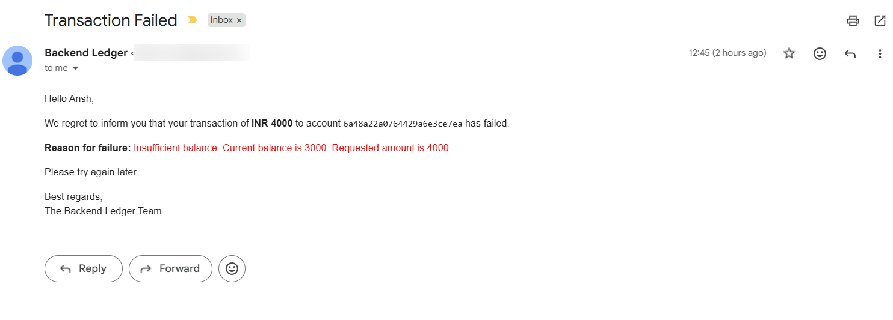

# Backend Ledger

A backend banking ledger system built with Node.js, Express, and MongoDB. It follows the double-entry accounting pattern — every transaction creates a DEBIT entry and a CREDIT entry, and account balance is always calculated live from the ledger, not stored as a fixed number.

## Features

- **JWT Authentication** – Register, login, logout with token stored in cookie. Logout blacklists the token so it can't be reused.
- **Accounts** – Each user can create one or more accounts. Account status can be ACTIVE, FROZEN, or CLOSED.
- **Double-Entry Ledger** – Every transaction writes a DEBIT entry (sender) and a CREDIT entry (receiver). Ledger entries are immutable — they cannot be updated or deleted once created.
- **Balance Calculation** – Balance is not stored directly. It is derived in real time from the ledger using MongoDB aggregation (total credit − total debit).
- **Fund Transfers** – Transfer money between two active accounts. Transaction fails if balance is insufficient.
- **Initial Funds** – A special system user account can credit initial balance into a normal user's account.
- **Idempotency** – Every transaction request needs an `idempotencyKey`. If the same key is sent again, the same transaction is returned instead of creating a duplicate.
- **Atomic Transactions** – MongoDB sessions are used so that a transaction, its debit entry, and its credit entry are all committed together, or none at all.
- **Email Notifications** – Emails are sent automatically for:
  - New user registration
  - Initial funds credited
  - Successful transaction
  - Failed transaction

## Tech Stack

| Layer          | Technology         |
|----------------|---------------------|
| Runtime        | Node.js             |
| Framework      | Express.js          |
| Database       | MongoDB (Mongoose)  |
| Auth           | JWT, bcryptjs        |
| Email          | Nodemailer (OAuth2) |

## Project Structure

```
backend-ledger/
├── server.js
├── src/
│   ├── app.js
│   ├── config/
│   │   └── db.js
│   ├── controllers/
│   │   ├── auth.controller.js
│   │   ├── account.controller.js
│   │   └── transaction.controller.js
│   ├── middleware/
│   │   └── auth.middleware.js
│   ├── models/
│   │   ├── user.model.js
│   │   ├── account.model.js
│   │   ├── ledger.model.js
│   │   ├── transaction.model.js
│   │   └── blackList.model.js
│   ├── routes/
│   │   ├── auth.routes.js
│   │   ├── account.routes.js
│   │   └── transaction.routes.js
│   └── services/
│       └── email.service.js
```

## Environment Variables

Create a `.env` file in the root folder with the following:

```
PORT=3000
MONGO_URI=your_mongodb_connection_string
JWT_SECRET=your_jwt_secret

EMAIL_USER=your_gmail_address
CLIENT_ID=your_google_oauth_client_id
CLIENT_SECRET=your_google_oauth_client_secret
REFRESH_TOKEN=your_google_oauth_refresh_token
```

## Installation

```bash
git clone <repository-url>
cd backend-ledger
npm install
npm run dev
```

Server runs on `http://localhost:3000` by default.

## API Endpoints

### Auth

| Method | Endpoint             | Description          | Protected |
|--------|-----------------------|-----------------------|-----------|
| POST   | `/api/auth/register`  | Register a new user   | No        |
| POST   | `/api/auth/login`     | Login and get token   | No        |
| POST   | `/api/auth/logout`    | Logout and blacklist token | No   |

### Accounts

| Method | Endpoint                          | Description                     | Protected |
|--------|-----------------------------------|----------------------------------|-----------|
| POST   | `/api/accounts`                   | Create a new account             | Yes       |
| GET    | `/api/accounts`                   | Get all accounts of logged-in user | Yes    |
| GET    | `/api/accounts/balance/:accountId`| Get balance of an account        | Yes       |

### Transactions

| Method | Endpoint                                | Description                                   | Protected            |
|--------|-------------------------------------------|------------------------------------------------|-----------------------|
| POST   | `/api/transactions`                       | Transfer funds between two accounts            | Yes                   |
| POST   | `/api/transactions/system/initial-funds`  | Credit initial funds from system account       | Yes (system user only)|

**Sample request body for transfer:**

```json
{
  "fromAccount": "account_id_1",
  "toAccount": "account_id_2",
  "amount": 500,
  "idempotencyKey": "unique-key-123"
}
```

If the same `idempotencyKey` is sent again, the API returns the original transaction instead of processing it again.

## How the Transfer Flow Works

1. Validate request body
2. Check idempotency key — if already used, return existing result
3. Check both accounts are ACTIVE
4. Calculate sender's current balance from the ledger
5. Reject if balance is insufficient
6. Start a MongoDB session/transaction
7. Create transaction record (status: PENDING)
8. Create DEBIT ledger entry for sender
9. Create CREDIT ledger entry for receiver
10. Mark transaction as COMPLETED and commit session
11. Send success or failure email to the user

## Email Notification Screenshots

**1. Registration Email**



**2. Initial Funds Credited Email**



**3. Transaction Successful Email**



**4. Transaction Failed Email**



