# Backend Ledger

A backend banking ledger system built with Node.js, Express, and MongoDB. It follows the double-entry accounting pattern — every transaction creates a DEBIT entry and a CREDIT entry, and account balance is always calculated live from the ledger, not stored as a fixed number.

## Features

- **JWT Authentication** – Register, login, logout with token stored in cookie. Logout blacklists the token so it can't be reused.
- **Accounts** – Each user can create one or more accounts. Account status can be ACTIVE, FROZEN, or CLOSED.
- **Double-Entry Ledger** – Every transaction writes a DEBIT entry (sender) and a CREDIT entry (receiver). Ledger entries are immutable — they cannot be updated or deleted once created.
- **Balance Calculation** – Balance is not stored directly. It is derived in real time from the ledger using MongoDB aggregation (total credit − total debit).
- **Fund Transfers** – Transfer money between two active accounts. Transaction fails if balance is insufficient.
- **Initial Funds** – A special system user account can credit initial balance into a normal user's account.
- **Idempotency** – Every transaction request needs an `idempotencyKey`. If the same key is sent again, the same transaction is returned instead of creating a duplicate.
- **Atomic Transactions** – MongoDB sessions are used so that a transaction, its debit entry, and its credit entry are all committed together, or none at all.
- **Email Notifications** – Emails are sent automatically for:
  - New user registration
  - Initial funds credited
  - Successful transaction
  - Failed transaction

## Tech Stack

| Layer          | Technology         |
|----------------|---------------------|
| Runtime        | Node.js             |
| Framework      | Express.js          |
| Database       | MongoDB (Mongoose)  |
| Auth           | JWT, bcryptjs        |
| Email          | Nodemailer (OAuth2) |

## Project Structure

```
backend-ledger/
├── server.js
├── src/
│   ├── app.js
│   ├── config/
│   │   └── db.js
│   ├── controllers/
│   │   ├── auth.controller.js
│   │   ├── account.controller.js
│   │   └── transaction.controller.js
│   ├── middleware/
│   │   └── auth.middleware.js
│   ├── models/
│   │   ├── user.model.js
│   │   ├── account.model.js
│   │   ├── ledger.model.js
│   │   ├── transaction.model.js
│   │   └── blackList.model.js
│   ├── routes/
│   │   ├── auth.routes.js
│   │   ├── account.routes.js
│   │   └── transaction.routes.js
│   └── services/
│       └── email.service.js
```

## Environment Variables

Create a `.env` file in the root folder with the following:

```
PORT=3001
MONGO_URI=your_mongodb_connection_string
JWT_SECRET=your_jwt_secret

EMAIL_USER=your_gmail_address
CLIENT_ID=your_google_oauth_client_id
CLIENT_SECRET=your_google_oauth_client_secret
REFRESH_TOKEN=your_google_oauth_refresh_token
```

## Installation

```bash
git clone <repository-url>
cd backend-ledger
npm install
npm run dev
```

Server runs on `http://localhost:3001` by default.

## API Endpoints

### Auth

| Method | Endpoint             | Description          | Protected |
|--------|-----------------------|-----------------------|-----------|
| POST   | `/api/auth/register`  | Register a new user   | No        |
| POST   | `/api/auth/login`     | Login and get token   | No        |
| POST   | `/api/auth/logout`    | Logout and blacklist token | No   |

### Accounts

| Method | Endpoint                          | Description                     | Protected |
|--------|-----------------------------------|----------------------------------|-----------|
| POST   | `/api/accounts`                   | Create a new account             | Yes       |
| GET    | `/api/accounts`                   | Get all accounts of logged-in user | Yes    |
| GET    | `/api/accounts/balance/:accountId`| Get balance of an account        | Yes       |

### Transactions

| Method | Endpoint                                | Description                                   | Protected            |
|--------|-------------------------------------------|------------------------------------------------|-----------------------|
| POST   | `/api/transactions`                       | Transfer funds between two accounts            | Yes                   |
| POST   | `/api/transactions/system/initial-funds`  | Credit initial funds from system account       | Yes (system user only)|

**Sample request body for transfer:**

```json
{
  "fromAccount": "account_id_1",
  "toAccount": "account_id_2",
  "amount": 500,
  "idempotencyKey": "unique-key-123"
}
```

If the same `idempotencyKey` is sent again, the API returns the original transaction instead of processing it again.

## How the Transfer Flow Works

1. Validate request body
2. Check idempotency key — if already used, return existing result
3. Check both accounts are ACTIVE
4. Calculate sender's current balance from the ledger
5. Reject if balance is insufficient
6. Start a MongoDB session/transaction
7. Create transaction record (status: PENDING)
8. Create DEBIT ledger entry for sender
9. Create CREDIT ledger entry for receiver
10. Mark transaction as COMPLETED and commit session
11. Send success or failure email to the user

## API Flow Walkthrough

### 1. User Registration

First, a normal user registers using the register API.

**API:** `POST http://localhost:3001/api/auth/register`

**Body:**
```json
{
  "name": "Ansh",
  "email": "your-email@gmail.com",
  "password": "123456"
}
```

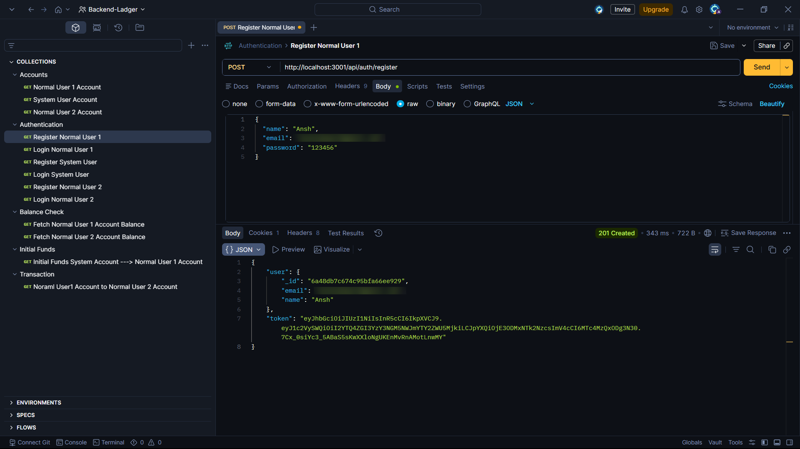

Once registration is successful, a confirmation email is sent to the user.

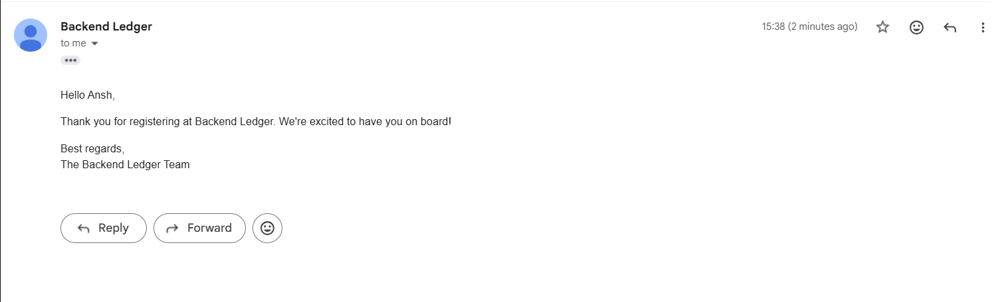

The new user is now saved in the `users` collection in MongoDB.

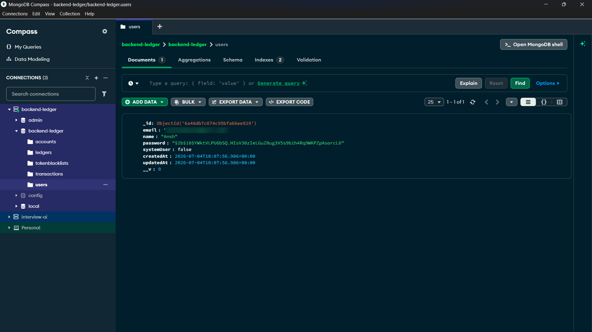

### 2. Account Creation

After registering, the user must be logged in (authenticated) to create an account. An account cannot be created without a valid login — the account is always created for the specific user who is currently logged in, based on their token.

**API:** `POST http://localhost:3001/api/accounts`

**Body:** None required (the user is identified from the login token)

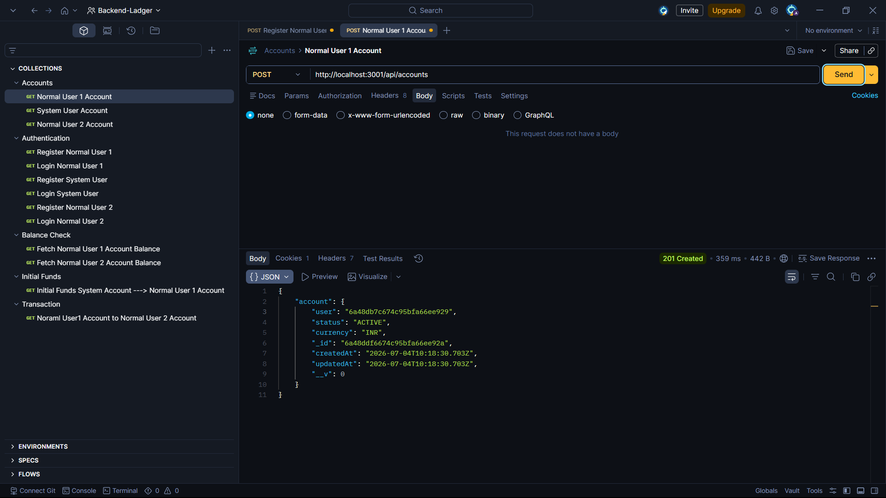

The account details (linked to that user) are saved in the `accounts` collection in MongoDB.

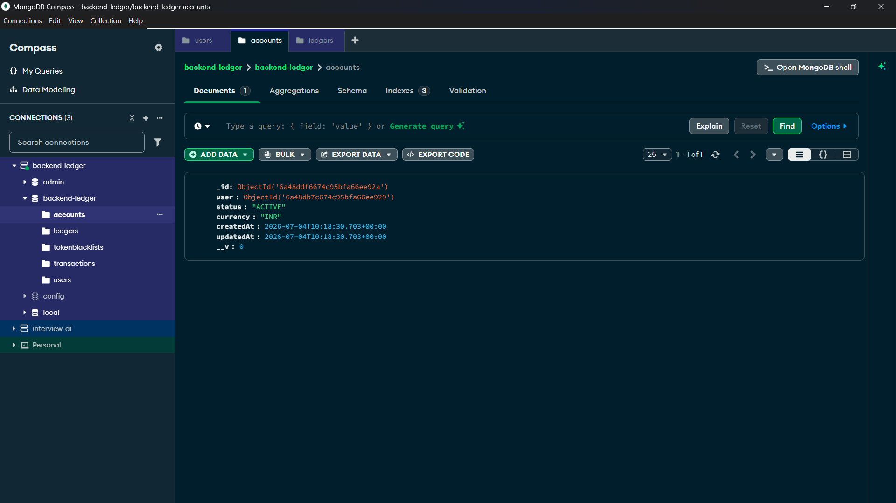

### 3. Registering a Second User

To test a money transfer between two accounts, a second normal user is registered the same way.

**API:** `POST http://localhost:3001/api/auth/register`

**Body:**
```json
{
  "name": "Rahul",
  "email": "rahul@gmail.com",
  "password": "123456"
}
```

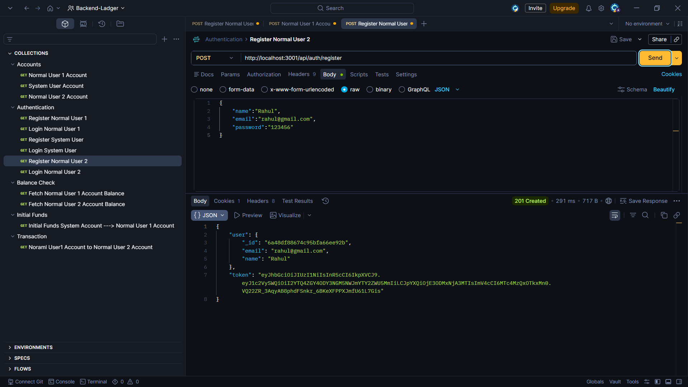

After registration, both users are now visible in the `users` collection in MongoDB.

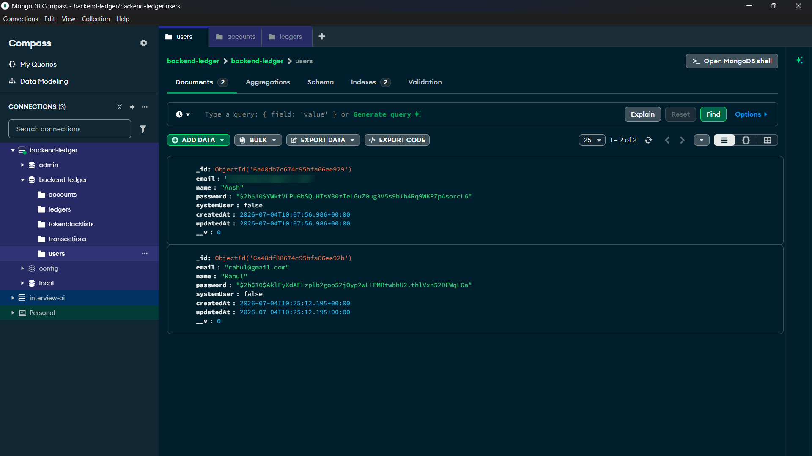

### 4. Creating an Account for the Second User

Just like the first user, the second user (after logging in) also needs their own account created before any transaction can happen.

**API:** `POST http://localhost:3001/api/accounts`

**Body:** None required (the user is identified from the login token)

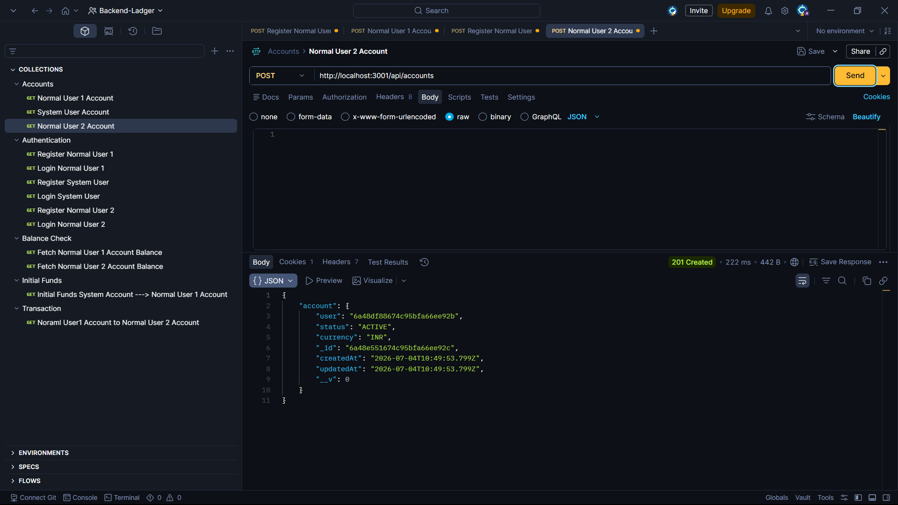

### 5. Creating the System User (for Initial Funds)

To credit initial balance into a normal user's account, a special **system user** is required. This system user is created the same way as a normal user, using the register API.

**API:** `POST http://localhost:3001/api/auth/register`

**Body:**
```json
{
  "name": "SYSTEM",
  "email": "system@test.com",
  "password": "123456"
}
```

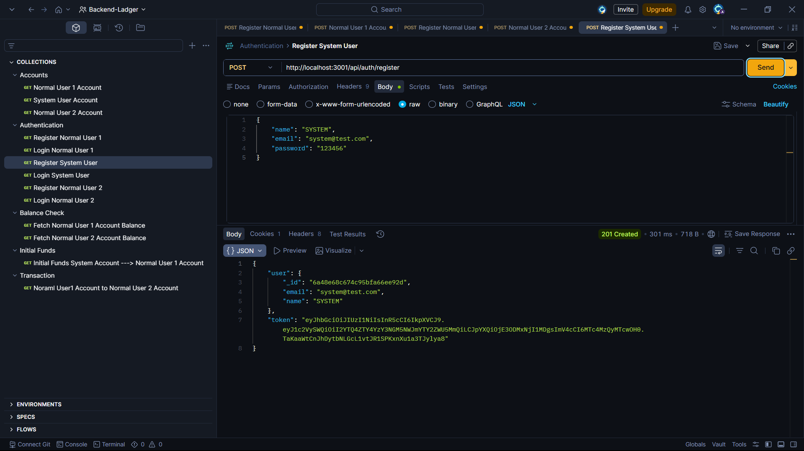

After registration, the system user is saved in the `users` collection in MongoDB just like any other user — but with `systemUser: false` by default. To make this user act as the system account, the `systemUser` field is manually updated from `false` to `true` directly in MongoDB.

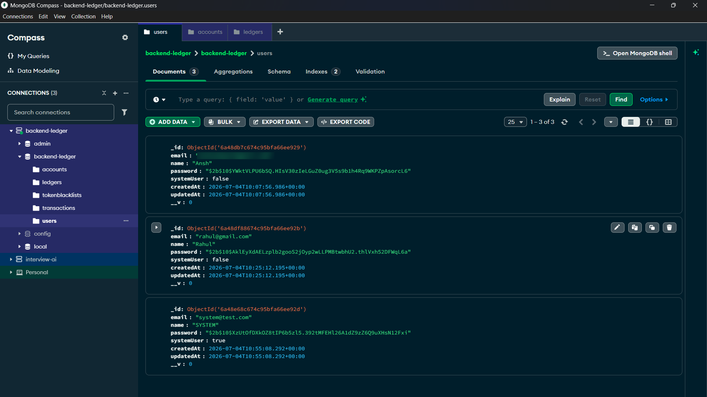

Once updated, the system user logs in like any other user.

**API:** `POST http://localhost:3001/api/auth/login`

**Body:**
```json
{
  "email": "system@test.com",
  "password": "123456"
}
```

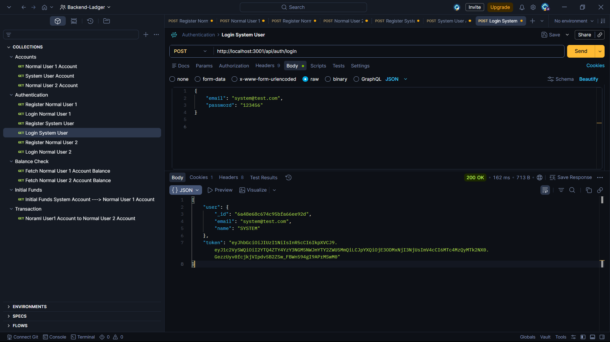

An account is then created for the system user (same as a normal user's account) — this account is what will be used to credit initial funds into other accounts.

**API:** `POST http://localhost:3001/api/accounts`

**Body:** None required (the user is identified from the login token)

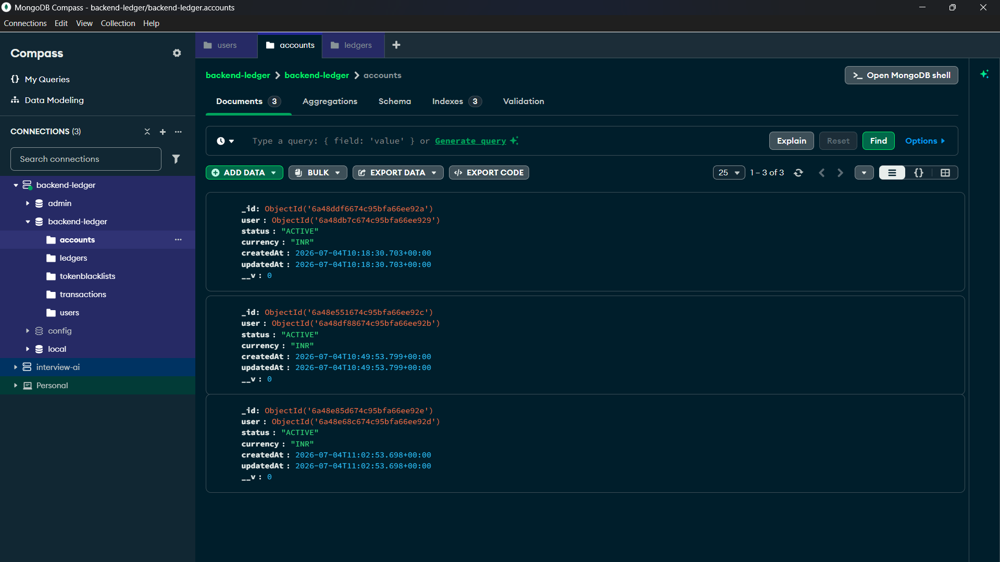

### 6. Checking Balance Before Initial Funds

Before crediting initial funds, the account balance can be checked using the balance API. To call this API, the user must be logged in, and the **account ID** is required (not the user ID). The account ID for a user can be found in the `accounts` collection in MongoDB.


Using that account ID, the balance is fetched — currently 0, since no funds have been added yet.

**API:** `GET http://localhost:3001/api/accounts/balance/:accountId`

**Body:** None required (account ID is passed in the URL, e.g. `/api/accounts/balance/6a48ddf6674c95bfa66ee92a`)

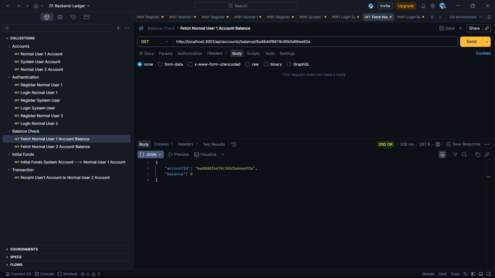

### 7. Initial Funds Transfer (System User → Normal User 1)

To add initial balance into Normal User 1's account, the **system user must be logged in** first.

**API:** `POST http://localhost:3001/api/auth/login`

**Body:**
```json
{
  "email": "system@test.com",
  "password": "123456"
}
```


Next, the required account IDs are picked up from the `accounts` collection in MongoDB — the system account's ID (sender) and Normal User 1's account ID (receiver).


A unique UUID is generated online and used as the `idempotencyKey`. This ensures that if the same request is accidentally sent twice, the transaction is not processed twice.

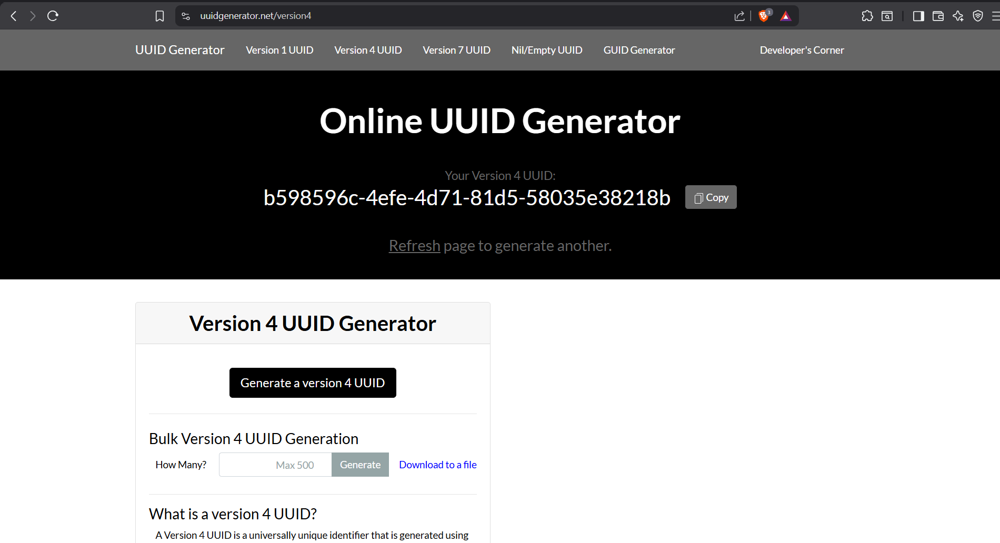

Now the initial funds transfer API is called with the system account as sender, Normal User 1's account as receiver, the amount, and the generated idempotency key.

**API:** `POST http://localhost:3001/api/transactions/system/initial-funds`

**Body:**
```json
{
  "toAccount": "6a48ddf6674c95bfa66ee92a",
  "amount": 10000,
  "idempotencyKey": "b598596c-4efe-4d71-81d5-58035e38218b"
}
```

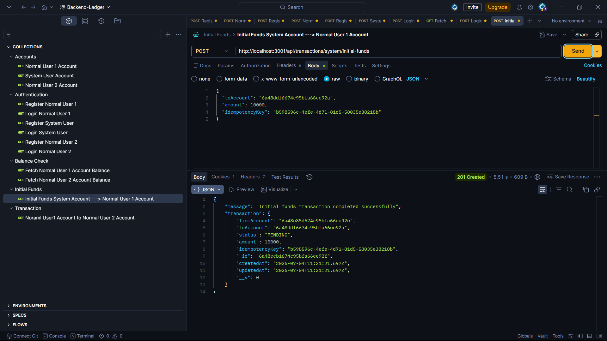

Once the transaction is successful, a confirmation email is sent with the credited amount.

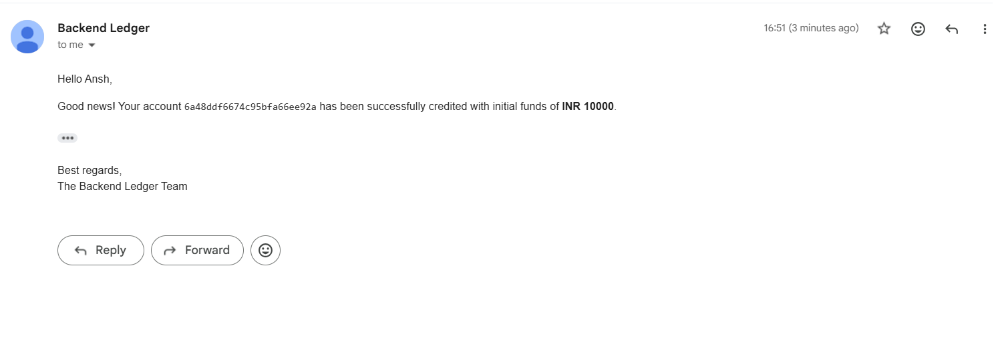

To verify, Normal User 1 logs in.

**API:** `POST http://localhost:3001/api/auth/login`

**Body:**
```json
{
  "email": "your-email@gmail.com",
  "password": "123456"
}
```

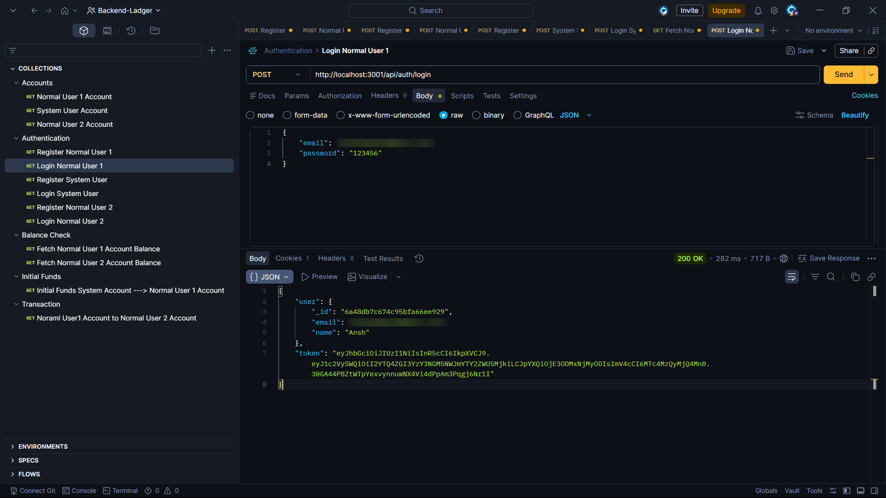

And fetches their balance again — it has now updated from 0 to 10000.

**API:** `GET http://localhost:3001/api/accounts/balance/:accountId`

**Body:** None required (account ID is passed in the URL)

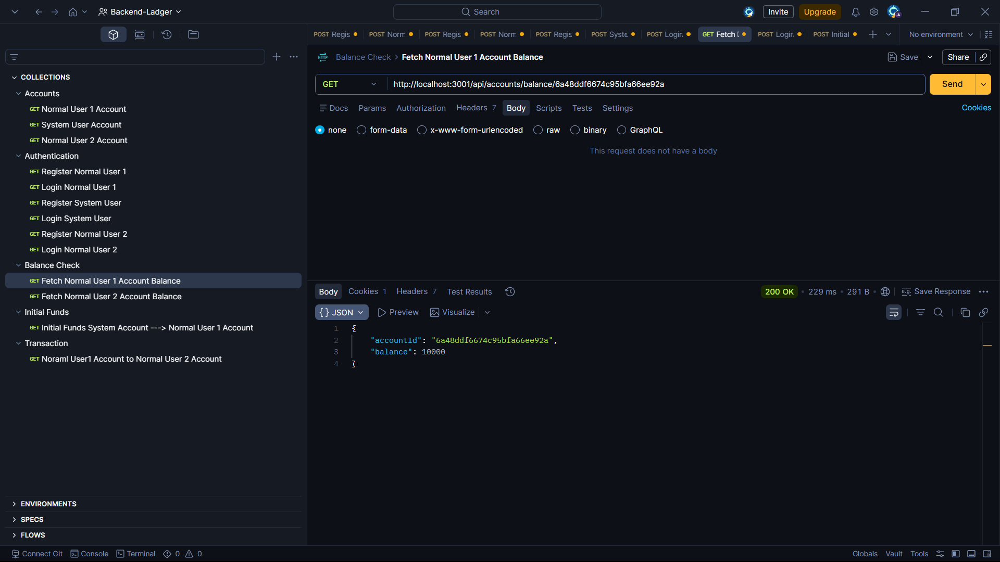

### 8. Transfer Between Two Normal Users (with Idempotency Check)

Now a transfer is made from Normal User 1's account to Normal User 2's account. The account IDs for both users are picked up from the `accounts` collection in MongoDB — Normal User 1's account goes in `fromAccount`, and Normal User 2's account goes in `toAccount`.

**API:** `POST http://localhost:3001/api/transactions`

**Body:**
```json
{
  "fromAccount": "6a48ddf6674c95bfa66ee92a",
  "toAccount": "6a48e551674c95bfa66ee92c",
  "amount": 6000,
  "idempotencyKey": "transfer-001"
}
```

The transaction completes successfully, and the remaining balance is returned in the response.

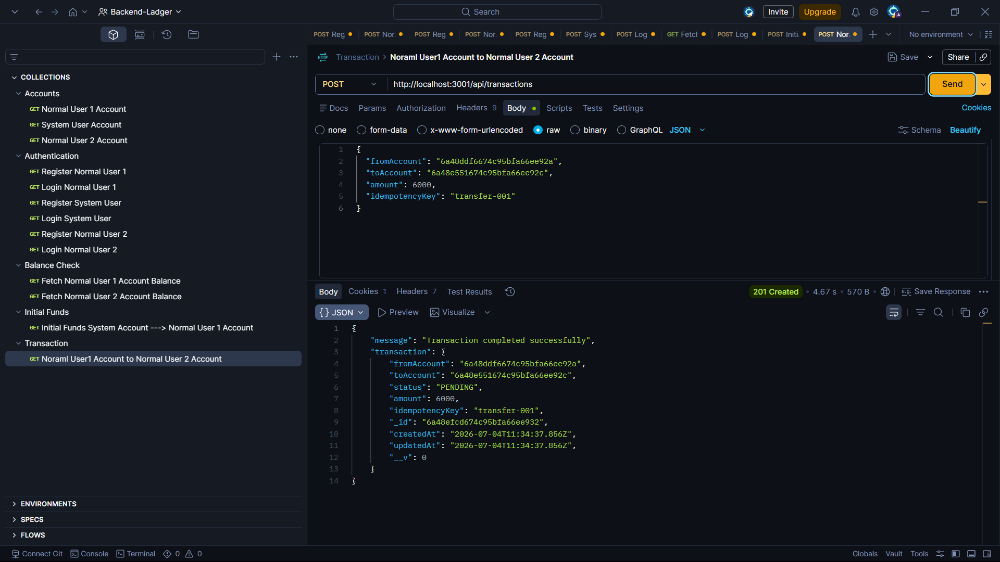

A confirmation email is also sent with the transaction details and remaining balance.

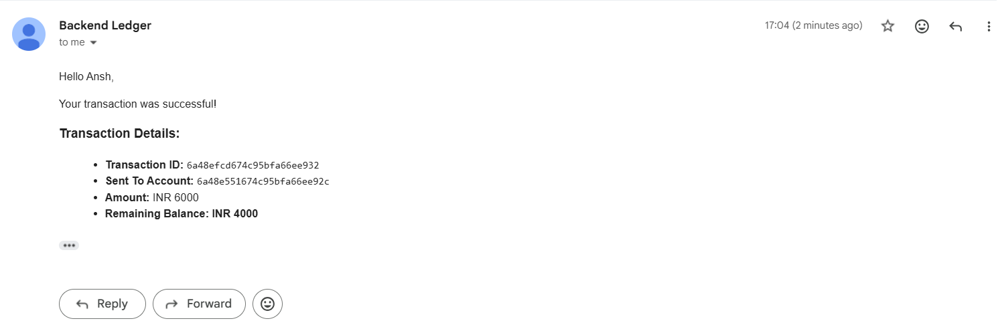

To test idempotency, the exact same request (same `idempotencyKey`) is sent again. Instead of creating a duplicate transaction, the API returns the original transaction with the message `"Transaction already processed"`.

**API:** `POST http://localhost:3001/api/transactions`

**Body:** Same as above (identical `idempotencyKey`)

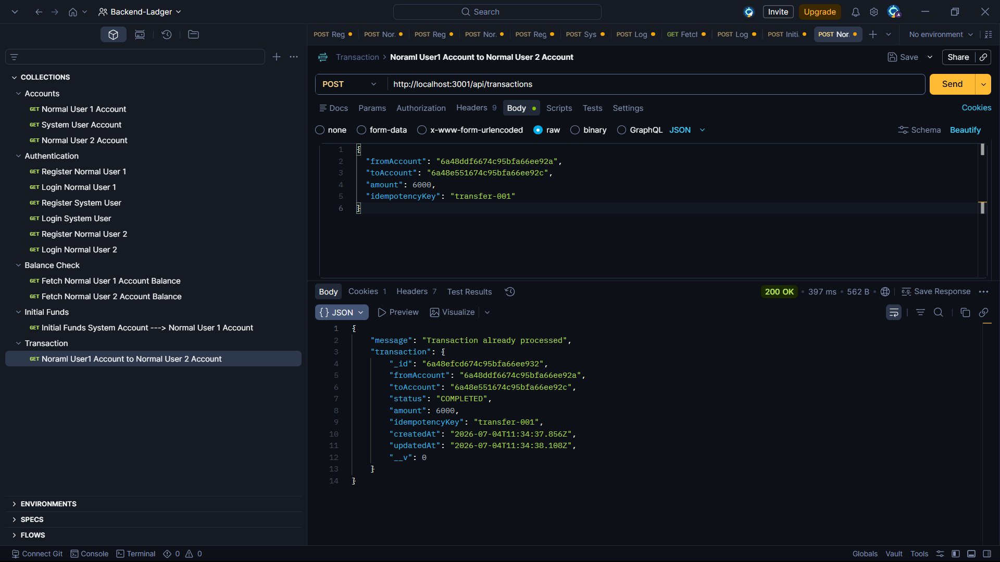

Finally, to confirm the money actually arrived, Normal User 2 (the receiver) logs in.

**API:** `POST http://localhost:3001/api/auth/login`

**Body:**
```json
{
  "email": "rahul@gmail.com",
  "password": "123456"
}
```

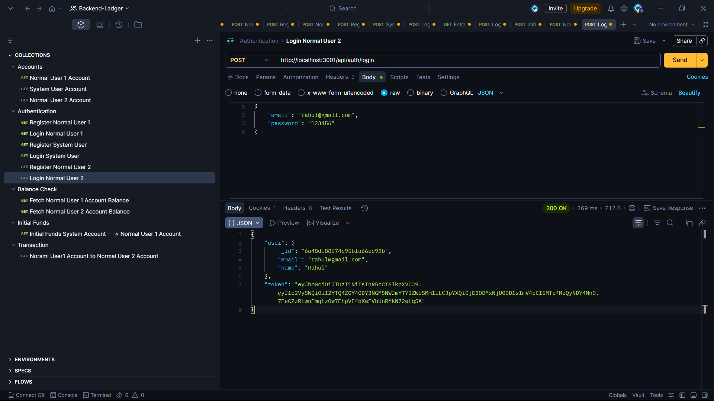

And fetches their balance — confirming the amount was received.

**API:** `GET http://localhost:3001/api/accounts/balance/:accountId`

**Body:** None required (account ID is passed in the URL)

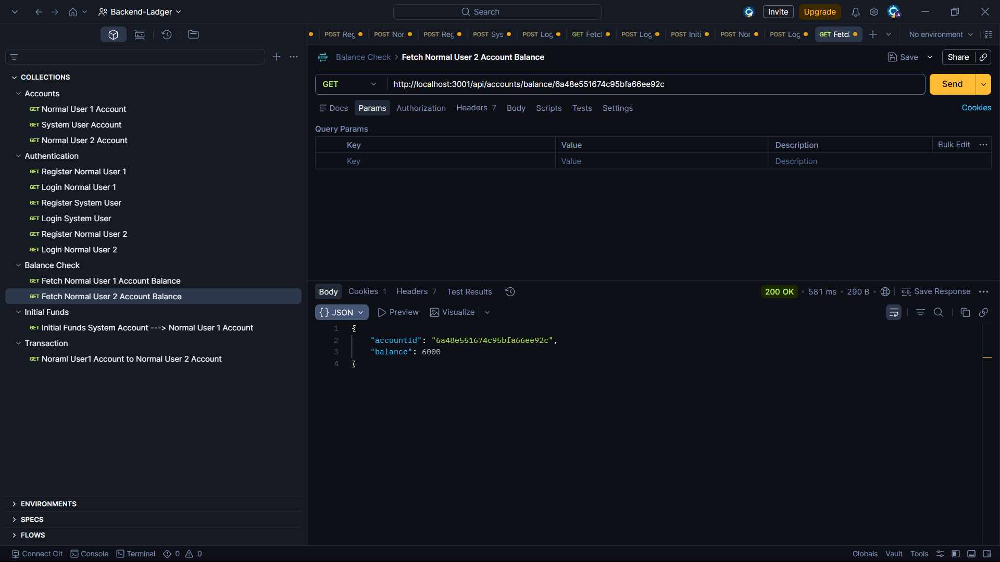

### 9. Failed Transaction (Insufficient Balance)

To test the failure case, Normal User 1 logs in again.

**API:** `POST http://localhost:3001/api/auth/login`

**Body:**
```json
{
  "email": "your-email@gmail.com",
  "password": "123456"
}
```


A transfer is then attempted with an amount greater than the current balance. The API rejects it with a `400 Bad Request` and a clear insufficient balance message.

**API:** `POST http://localhost:3001/api/transactions`

**Body:**
```json
{
  "fromAccount": "6a48ddf6674c95bfa66ee92a",
  "toAccount": "6a48e551674c95bfa66ee92c",
  "amount": 6000,
  "idempotencyKey": "transfer-002"
}
```

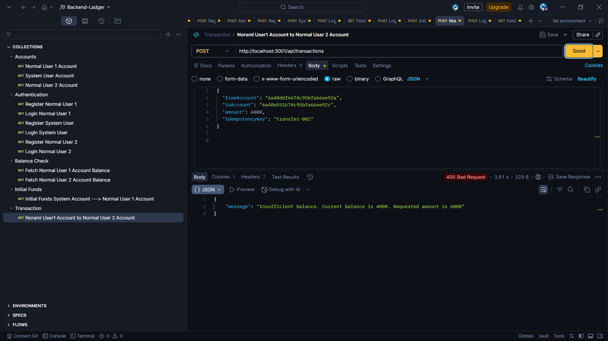

A failure email is also sent, explaining why the transaction did not go through.

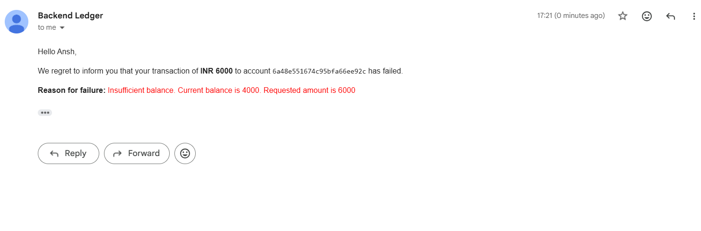

### 10. Verifying the Database (Transactions + Ledger)

Finally, checking MongoDB confirms everything worked as expected.

The `transactions` collection shows both completed transactions (initial funds and the successful transfer) with status `COMPLETED`.


The `ledgers` collection shows the double-entry accounting in action — every transaction creates one `DEBIT` entry (sender) and one `CREDIT` entry (receiver), keeping the books balanced.


